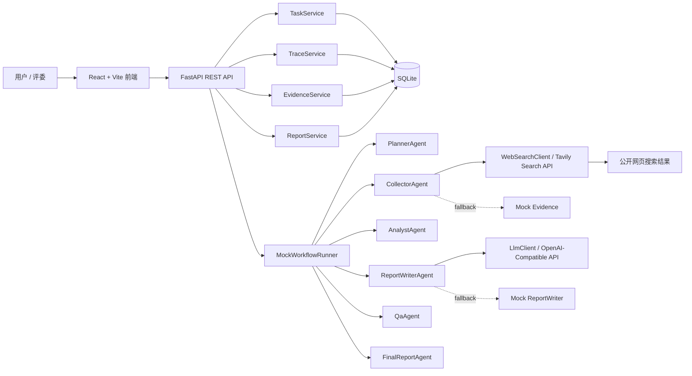
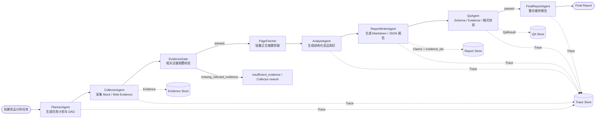
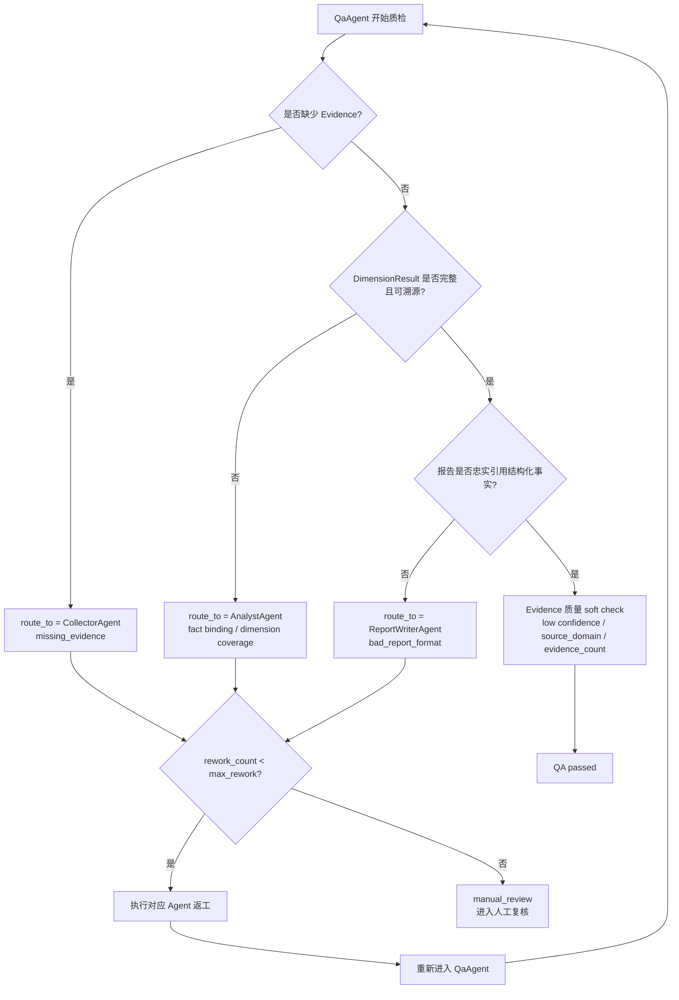
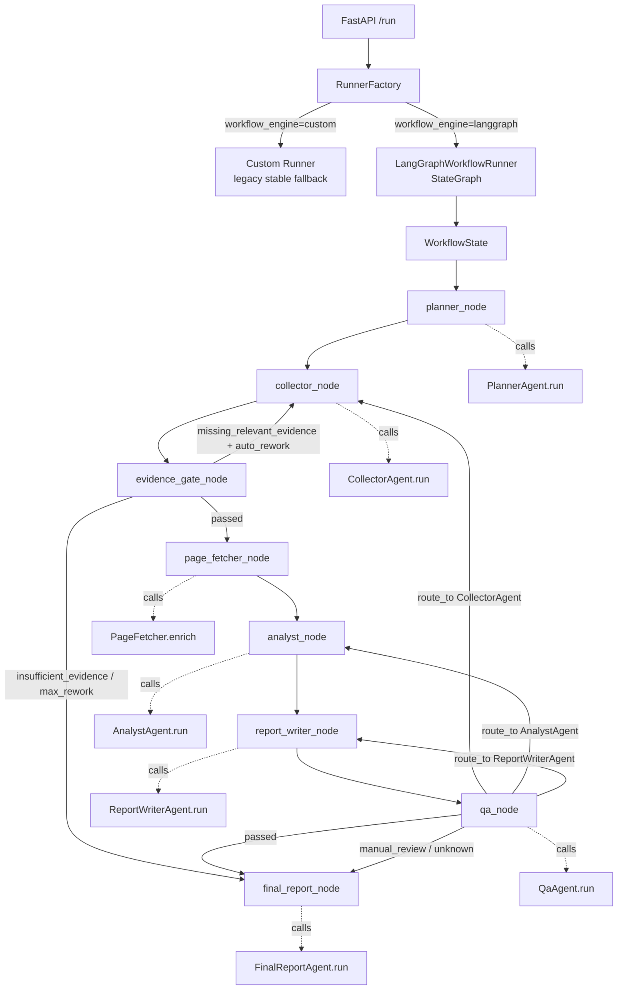
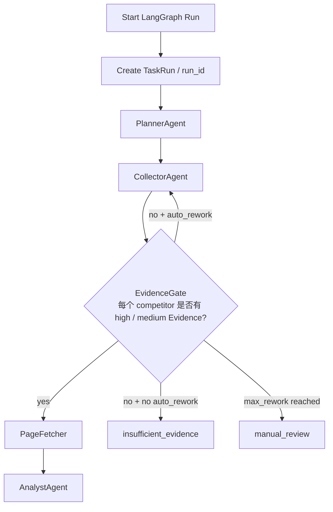
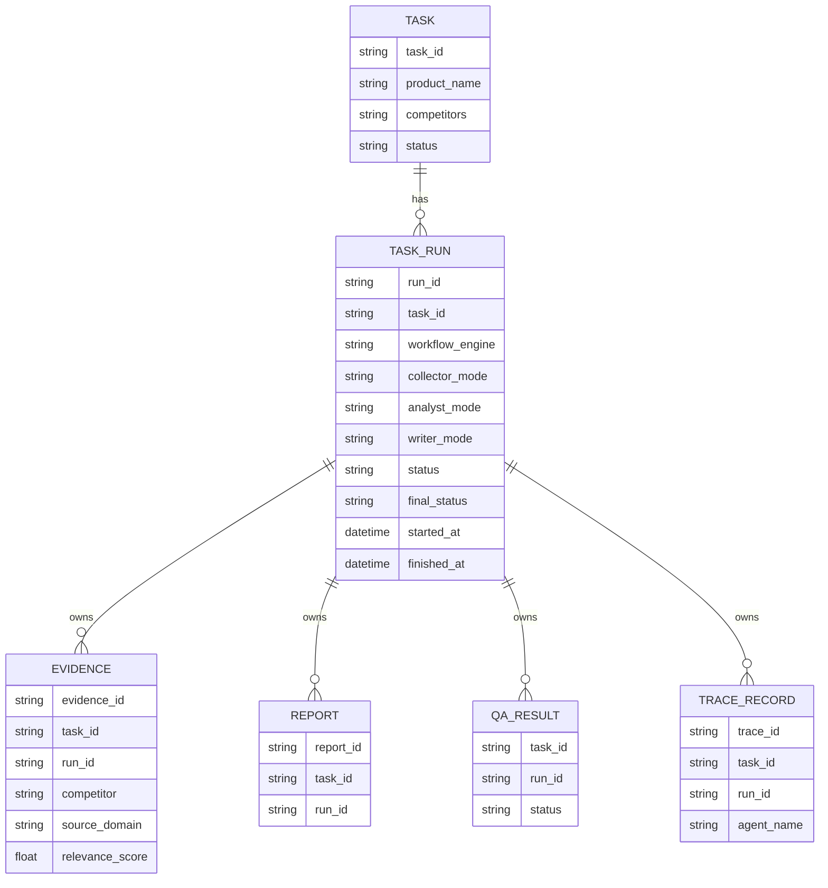

# CIS 多 Agent 竞品分析系统架构图

本文档用于答辩 PPT 或项目说明，概括当前 Demo 的系统结构、Agent DAG 和 QA 自动返工闭环。

## 1. 系统架构图

说明：

1. 前端通过 FastAPI REST API 创建任务、运行 workflow、查看报告、Evidence、QA 和 Trace。
2. 后端使用 SQLite 存储 Task、Evidence、Report、QA 和 Trace，便于本地演示和快速调试。
3. CollectorAgent 支持 Mock 与 Web 两种模式，Web 模式通过 Tavily 搜索公开网页结果并转换为 Evidence。
4. ReportWriterAgent 支持 Mock 与 LLM 两种模式，LLM 模式使用 OpenAI-compatible Chat Completions。
5. Web Search 或 LLM 调用失败时不会中断 workflow，而是 fallback 到 Mock，并在 Trace 中记录原因。

## 2. Agent DAG 工作流图

说明：

1. 整个竞品分析被拆成 Planner、Collector、EvidenceGate、PageFetcher、Analyst、ReportWriter、QA 和 FinalReport 步骤。
2. 每个 Agent 都使用结构化 Input / Output Schema，避免自由文本在 Agent 之间失控传递。
3. EvidenceGate 位于 Collector 后、PageFetcher 前，用于拦截缺少 high / medium relevance Evidence 的任务。
4. PageFetcher 只对通过门禁的公开网页 Evidence 抓取短正文摘要，失败时 fallback 到搜索 snippet。
5. AnalystAgent 生成的每条 `DimensionResult` 必须绑定 `evidence_ids`；ReportWriter 只引用已校验事实，不再生成新的 Claim。

## 3. QA 自动返工流程图

说明：

1. QA 会优先检查硬错误：缺少 Evidence、结构化抽取异常、报告格式错误或 Claim 缺少 evidence_ids。
2. 不同错误会路由回不同 Agent：缺少证据回 Collector，抽取问题回 Analyst，报告问题回 ReportWriter。
3. 如果勾选 `auto_rework=true`，系统会自动执行返工 Agent，然后重新进入 QA。
4. 最大返工次数为 `max_rework=3`，超过后进入 `manual_review`，避免无限循环。
5. Evidence 质量问题属于 soft suggestion，例如低可信证据不会 hard fail，但会提示补充官方或高质量来源。

## 4. LangGraph Workflow Engine

说明：
1. LangGraph 只接入编排层，节点函数不复制 Agent 业务逻辑，只包装现有 `Agent.run()`。
2. `WorkflowState` 保存 task、各 Agent 输出、Evidence、Report、QA 结果、返工次数、节点序列和条件路由记录。
3. `Custom Runner` 保留为 legacy fallback，只维护当前稳定主链路；后续 RAG、Retriever、SWOT 等新节点只接入 LangGraph。
4. QA 后通过 conditional edge 回到 Collector、Analyst 或 ReportWriter，保证返工后续路径完整。
5. 每次 LangGraph 运行额外写入 `WorkflowEngine` Trace，用于展示 workflow_engine、node_sequence 和 conditional_routes_taken。

## 5. Run Isolation 与 EvidenceGate

说明：
1. Phase 10 后每次 workflow run 都会创建 TaskRun，并生成独立 `run_id`。
2. Evidence、Report、QA 和 Trace 都绑定当前 `run_id`，旧运行数据不会参与当前运行。
3. EvidenceGate 是 RAG 前的数据质量防线，避免 unrelated Evidence 被索引或被后续 Agent 当成事实依据。
4. PageFetcher 只处理通过 EvidenceGate 的 relevant Evidence，并保存截断后的 `content_excerpt`。
5. 随机竞品缺少相关公开证据时，系统会停在 `insufficient_evidence` 或打回 Collector，不进入正式报告生成。

## 6. TaskRun / run_id 版本隔离

说明：
1. `Task` 是用户创建的分析目标，`TaskRun` 是该目标的一次具体 workflow 执行。
2. 旧接口默认返回 latest run；历史版本通过 `/api/tasks/{task_id}/runs/{run_id}/...` 查询。
3. 前端 Run History 可以切换不同 run，Evidence、Report、QA、Trace 和 workflow summary 会跟随切换。
4. Phase 10 的 run_id 隔离替代了 Phase 9.1 的 cleanup 过渡策略，支持报告版本回放和 Trace 回放。
